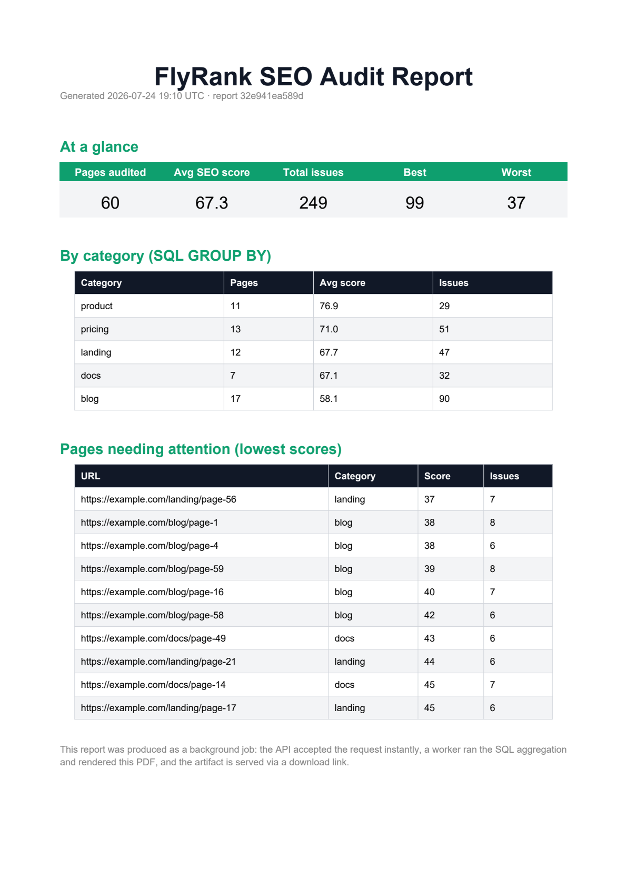
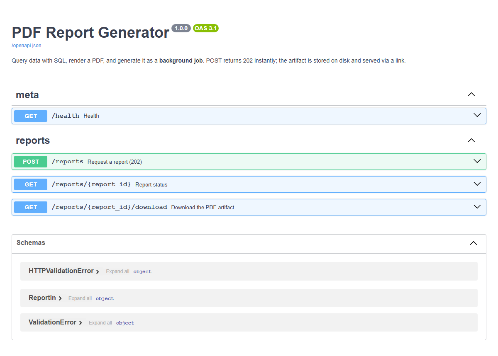

# PDF Report Generator

Query data with SQL, render it into a **PDF report**, and generate it as a **background job** — the classic SaaS feature that ties four weeks together (SQL aggregation + artifact handling + the accept-fast job pattern).

```
POST /reports                 -> 202 { report_id, status_url }   # instant
GET  /reports/{id}            -> status (+ download_url when ready)
GET  /reports/{id}/download   -> the PDF artifact
GET  /health
```

## Why it's built this way

- **Background job** — rendering a PDF is slow-ish and CPU-bound. The request returns **202** immediately; a worker thread does the SQL + rendering; you poll for status.
- **Store & link, don't pass bytes** — the PDF is written to `reports/<id>.pdf` and served via a **download link**. You never stuff a multi-MB file into a JSON response.
- **Real SQL aggregation** — the report is `COUNT` / `AVG` / `GROUP BY` / `ORDER BY` over a seeded `page_audits` table, not numbers computed in Python.

## Run

```bash
pip install -r requirements.txt && uvicorn app:app --reload --port 8011
```

Swagger: http://localhost:8011/docs

Quick demo:

```bash
# request a report
curl -i -X POST http://localhost:8011/reports -H "Content-Type: application/json" -d "{\"title\":\"FlyRank SEO Audit\"}"
# poll status, then download
curl -L http://localhost:8011/reports/<id>/download -o report.pdf
```

## What's in the PDF

- **At a glance** KPI band — pages audited, avg SEO score, total issues, best/worst
- **By category** table — SQL `GROUP BY category` with per-category averages
- **Pages needing attention** — lowest-scoring pages (`ORDER BY seo_score ASC`)

### Sample report (page preview)

Rendered from [`reports/sample-report.pdf`](reports/sample-report.pdf):



### Interactive docs



## Proof

```
POST /reports -> 202 in 0.034s
status: succeeded  size_bytes: 3354
download -> 200  is_pdf: b'%PDF-'
```

## Stretch: scheduling

`app.py` includes a `_Scheduler` thread. Set its `interval_seconds` above `0` in `lifespan` to auto-generate a report on a fixed cadence (on-demand now, on a schedule for stretch).

## Files

```
app.py             # FastAPI routes + background worker + optional scheduler
report_builder.py  # reportlab -> polished PDF artifact
data.py            # SQLite dataset + aggregation queries
```

## License

MIT — FlyRank Backend internship.
